The diagram below illustrates a simplified form of the typical disbursement flow. The OpenG2P ERP augments this by providing tools to manage each step of the flow.

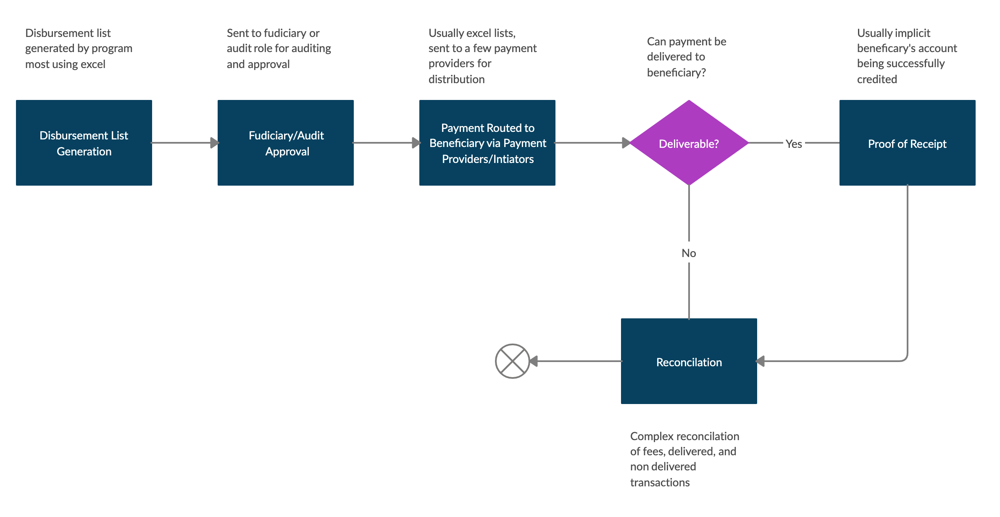

## Prerequisites

To effectively follow OpenG2P ERP specific concepts here you would need to first read the [Program Management](program-management.md) sections, specifically relating to [Program Categories](program-management.md#Program-Categories) and [What Determines Inclusion in Disbursement List](program-management.md#What-Determines-Inclusion-in-Disbursement-List).

### Banks, Mobile Money Providers, & Beneficiary Accounts

Before you can start executing cash transfers to beneficiaries, you would need to first understand how they are going to be paid. This is usually via existing financial service providers (FSP) like banks, mobile money providers, and MFIs. You record bank account information as part of the beneficiary's record. Bank and FSP are interchangeable used throughout this documentation; references to banks refer to all registered financial service providers that can hold person's deposit accounts.

### FSP (Banks) vs Payment Initiator

FSPs are not necessarily the same as payment initiators. An FSP is the actual institution hosting a beneficiary account and the payment initiator (PI) is the party that provides payment routing services enabling you to move funds between your account and account holders of bank. That initiator can be the national switch, a registered FSP connected to the national switch and providing initiation services, a mobile money provider, or an FSP providing API access to move funds between its account holders.

FSPs have a many-to-one relationship with PIs.

### Creating a Supported FSP

To record a beneficiary's account, the bank holding that account needs to be first configured into the system; if not, that bank isn't part of the selection of banks when creating account.

A new FSP can be added from the OpenG2P settings page `Beneficiaries/Configuration/Settings`. Scroll down to the `Configuration` section and click on `Add Financial Institutions`

{:width="50%"}

From the resulting page, clicking `create` brings up the form for adding new FSPs. The form provides numerous fields that allow you to configure how account numbers for that provider are verified, the type of institution, and how payment instructions are transmitted through PIs. Only the `name` and `type` is required however providing other information like validation regex at least helps ensure that accounts numbers recorded are validated against an expected pattern.

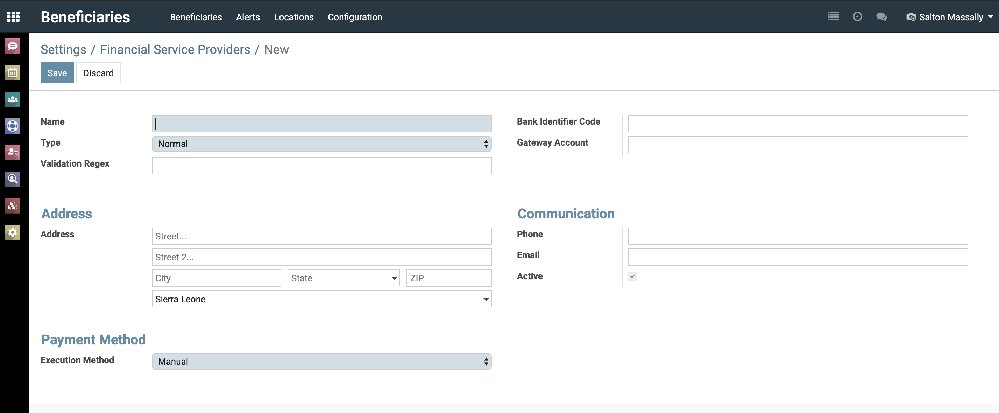{:width="80%"}

| Field                | Required | Description                                                                                                                                                                                                                                                                                                                                                                                                                                            |
|----------------------|----------|--------------------------------------------------------------------------------------------------------------------------------------------------------------------------------------------------------------------------------------------------------------------------------------------------------------------------------------------------------------------------------------------------------------------------------------------------------|
| Name                 | True     | Name of the institution                                                                                                                                                                                                                                                                                                                                                                                                                                |
| Type                 | True     | Type, e.g Normal (representing conventional banks) and mobile money                                                                                                                                                                                                                                                                                                                                                                                    |
| Validation Regex     | False    | A regex that account number should be validated against, e.g a regex for a mobile money provider will validate that the account number fits the pattern of a valid mobile number for that provider. Regex is however an advanced concept outside the scope of this documentation. Note that invalid regex can prevent beneficiary accounts from being recorded, so when in doubt leave empty and even if you are familiar with regexes, please test carefully  |
| Bank Identifier Code | False    | Used to identify banks and financial institutions globally.                                                                                                                                                                                                                                                                                                                                                                                            |
| Gateway Account      | False    | The program's account number with this financial institution. Usually the account number that the program makes payment from at this FSP                                                                                                                                                                                                                                                                                                               |
| Address              | False    | Address information for the FSP                                                                                                                                                                                                                                                                                                                                                                                                                        |
| Communication        | False    | Group of fields relating to communication with FSPs point of contact                                                                                                                                                                                                                                                                                                                                                                                   |
| Execution Method     | True     | An advanced configuration that denotes how payment instructions are transferred to the FSP usually via PI. For the current purpose, leaving this at manual suffices|

### Recording Bank Account For Beneficiaries

After the list of supported FSPs have been recorded, you can now record bank or payment details for beneficiaries. This can be found on the `Internal Info` tab of the beneficiary record. Clicking the arrow on the right of the text boxes brings up a dropdown with the `Create and Edit` option that when clicks calls up the bank account entry form.

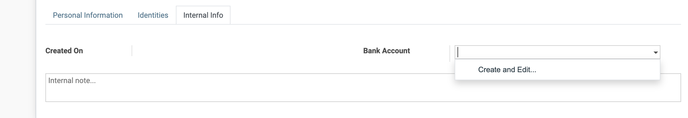{:width="50%"}

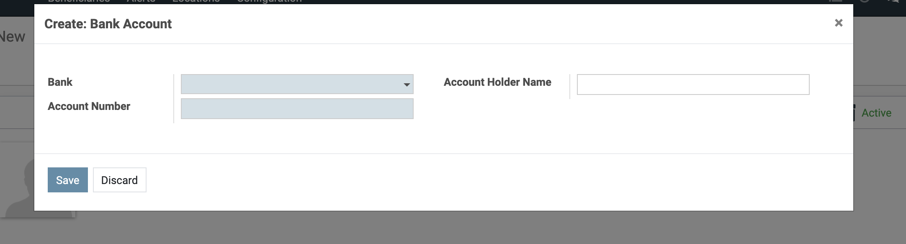{:width="50%"}

| Field               | Required | Description                                                     |
|---------------------|----------|-----------------------------------------------------------------|
| Bank                | True     | A selection from the list of FSPs supported by program          |
| Account Number      | True     | Account number of beneficiary                                   |
| Account Holder Name | False    | Account holder name if different from that of the beneficiary's |

All changes to beneficiary bank accounts are added to the audit trial of the beneficiary's record.

## Key Concepts

The ERP provides a set of tools that aid generation and validation of disbursements lists. Central to the ERP's approach are:

- **Disbursement period (or cycle)** which are intervals between disbursement and usually starts from the end of the last cycle
- **Disbursement batch (or list)** contains KYC information, bank accounts, and amount for each beneficiary being paid in that batch. Batches are always associated to a period.

Disbursement batches can only be generated for a single program. By default every beneficiary actively registered to a program is included in the batch however the `Disbursement Officer` or `Disbursement Manager`  can filter to a subset of beneficiaries actively registered to a program.

A disbursement batch has the following properties and associations, most of which will be further delved into later:

| Property/Association | Description                                                                                                                                                                                                                                                                   |
|----------------------|-------------------------------------------------------------------------------------------------------------------------------------------------------------------------------------------------------------------------------------------------------------------------------|
| Program              | Program that disbursement list is being generated for                                                                                                                                                                                                                         |
| Period               | Period or cycle, start and end date, for which this batch is being generated                                                                                                                                                                                                  |
| State                | Series of states or stages, see [The Flow](#the-flow) below that the batch goes through starting from the list being generated to payment instructions being sent out through payment initiators                                                                                                                         |
| Slips                | Individual disbursement slips of beneficiaries. Has information on the amount to pay beneficiary, how that amount was calculated, and bank account to pay to. Also serves a record for each payment made to beneficiaries                                                     |
| Alerts               | Instances of exceptions or errors within the batch that needs to be investigated. Example, being unable to generate a slip for beneficiary because a program category/classification is not assigned to or a beneficiary who has an pending disenrollment workflow being included in the batch  |
| Advices              | Payment instructions grouped by payment initiator                                                                                                                                                                                                                                        |
| Amendments           | Onetime changes made to a beneficiaries disbursement slips,example, to compensate for an incorrect disbursed amount in the previous batch                                                                                                                                     |
| Checklist            | Series of checklist that should be checked off before the batch can proceed to the next state                                                                                                                                                                                     |

### The Flow

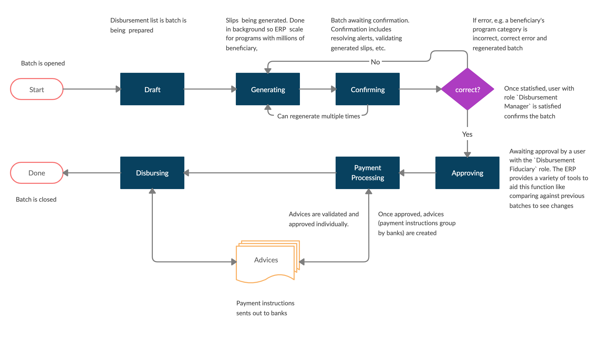{:width="100%"}

The illustration above depicts how the ERP manages the disbursement workflow

## Processing Disbursements

### Start a Disbursement Batch

Disbursements are managed from the disbursement application. You get there by clicking on the `Disbursement` icon from the dashboard.

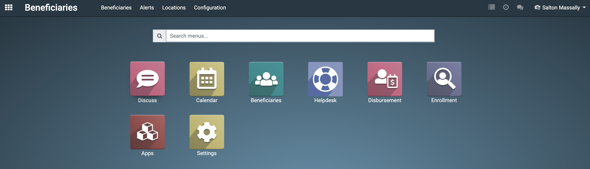{:width="80%"}

From `Disbursement` application home, click on create to bring up the disbursement batch create form. Only users with the role `Disbursement Officer` can create/open disbursement batches.

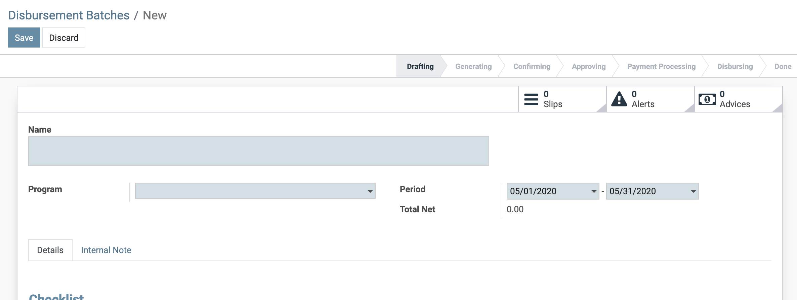{:width="80%"}

| Field   | Required | Description                                                                                                                                     |
|---------|----------|-------------------------------------------------------------------------------------------------------------------------------------------------|
| Name    | True     | A descriptive name for the disbursement batch e.g. "May 1st - May 15th Ebola Workers' Payments" or "Cycle 5 - Ebola Response Workers' Payments" |
| Program | True     | Program that batch is being created for                                                                                                         |
| Period  | True     | Start and end date of period                                                                                                         |

### Generating Disbursement Slips for Batch

Disbursement slips are the actual calculations and records of beneficiary disbursements. Creating a batch alone is not enough, disbursement slips will have to be created for every individual that should be paid as part of that batch.

However before you can proceed to that step you may need to address and check open items in the batch checklist. The checklist is there to provide a reminder of tasks that may be outstanding and may affect the correctness of your batch. Once satisfied they are adequately addressed check the boxes, click save, and proceed.

[batch-draft-checklist](../images/batch-draft-checklist.png){:width="80%"}

> "Generate Slips" action button remains invisible until these open checklist are checked off and the batch saved.
>
{: .important}

There are two methods to generating disbursement slips: 1) automating generation 2) manually adding beneficiaries to the batch

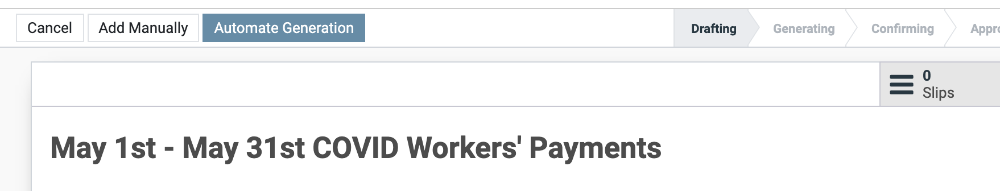{:width="50%"}

**Automating Generation** is the simpler and recommended method, it selects all beneficiaries with active enrollments in the program for which the batch is being generated and creates disbursement slips for each.

**Add Manually** allows you to filter and choose beneficiaries you want in the batch as long as those beneficiaries have active enrollments in the program for which the batch is being generated.

On triggering generation a background job is queued that does the actual work of computing and creating individual slips. How long this takes will depend on the number of beneficiaries that make up the batch, your server's capacity, and ERP configuration. Learn more about this in [our advanced guides](advanced/server-config.md).

{:width="50%"}

You will be notified via a UI pop-up and email when the job is completed.

Alternatively you can check:

1. the job tray which will show the status of the batch

	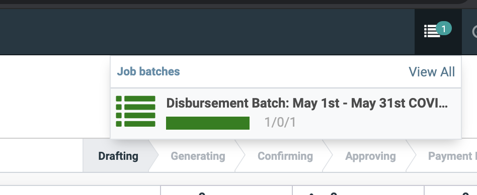{:width="50%"}

2. the `Generation Status` on the batch record which will show the status of the batch

	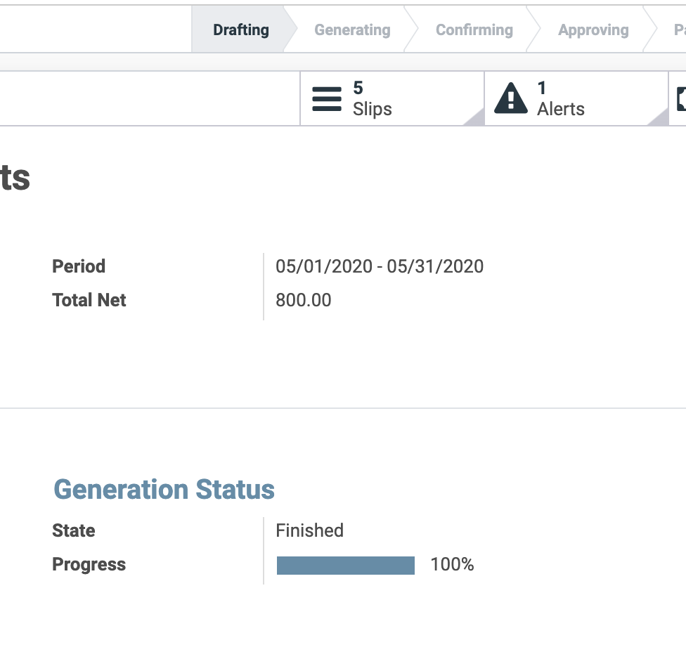{:width="50%"}

>**NOTE**: You may need to reload the batch view to see the status change

### Dealing with Generation Errors

@TODO[how do we investigate and re-queue]

### Validating and Confirming Disbursement Batch

On completion of the batch generation job, the status is changed back to `Draft`. In this state, it can be regenerated, e.g. if their are some processing errors like misconfigured program categorization, or confirmed.

#### Disbursement Alerts

Disbursement alerts are instances of possible errors in the list that should be investigated. These are triggered by a rules engine that runs each slips through a set of configureable rules that if triggered results in an alert. The ERP comes with a set of rules pre-configured and the user has the option of adding more. See [advanced disbursement configuration](./advanced/disbursement-configuration.md). Examples of existing rules include:

- Disbursed amount for beneficiary is zero or negative
- Beneficiary excluded from batch - A beneficiary who should be added to a batch could not
- An active investigation workflow exists for a beneficiary
- Could not find an active enrollment for beneficiary in the program
- An error was encountered while computing slip for beneficiary
- An active disenrollment workflow exists for beneficiary
- A beneficiary's slip not added to an advice as banking information is unavailable for beneficiary

Instances of alerts can be seen on the batch record and clicking on it will show a list of alerts if any.

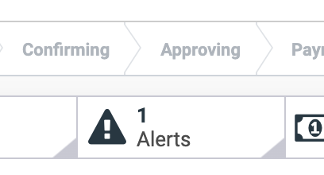{:width="50%"}

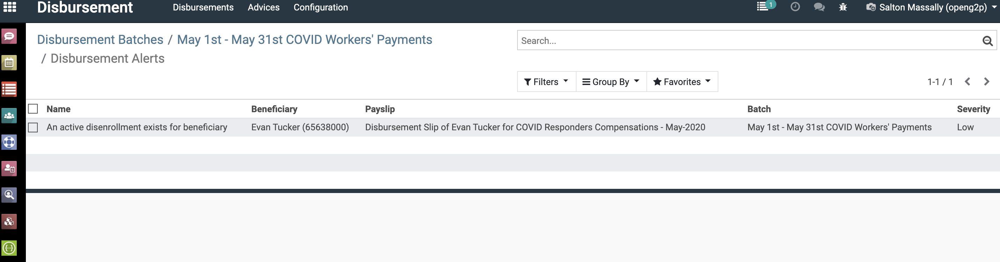{:width="50%"}

#### Validating a Batch

The ERP provides a variety of tools to aid the process of validating disbursement slips:

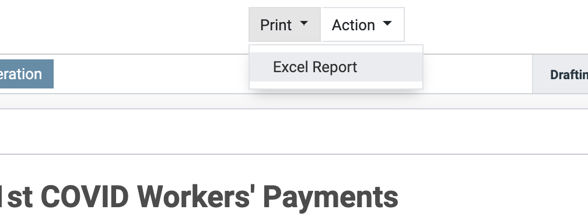{:width="50%"}

You can download the entire list to excel and run custom checks and validations

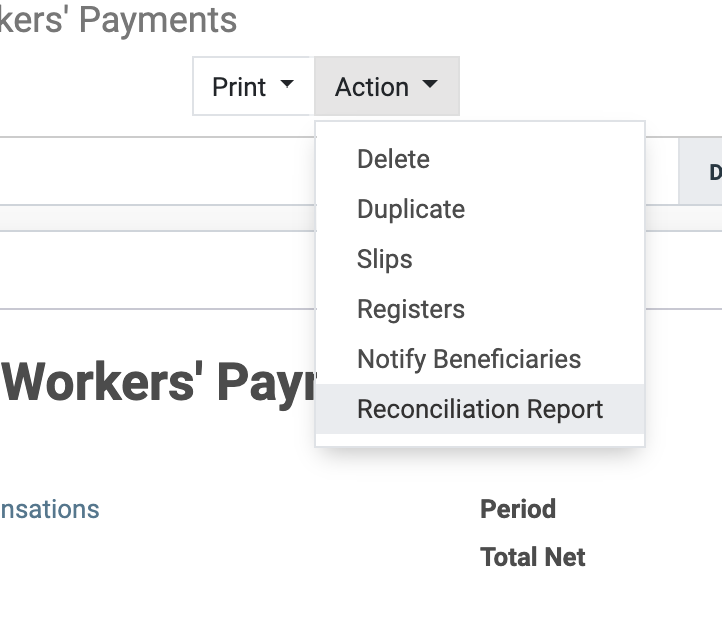{:width="50%"}

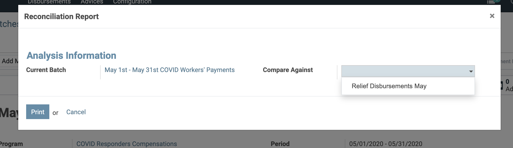{:width="50%"}

You can compare the disbursement list against a previous periods to see what changes were made.

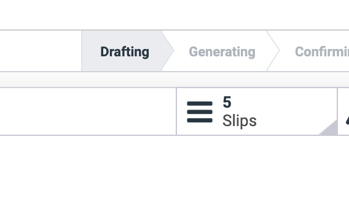{:width="50%"}

You can directly browse though the slips and check the calculations manually.

#### Regenerating a Batch

A batch can be regenerated multiple times following the same previous steps until it is confirmed.

#### Confirming a Batch

A batch is confirmed, assuming that no unchecked box exists in the checklist section, by a user with the role `Disbursement Manager` on clicking the `Confirm` button in header.

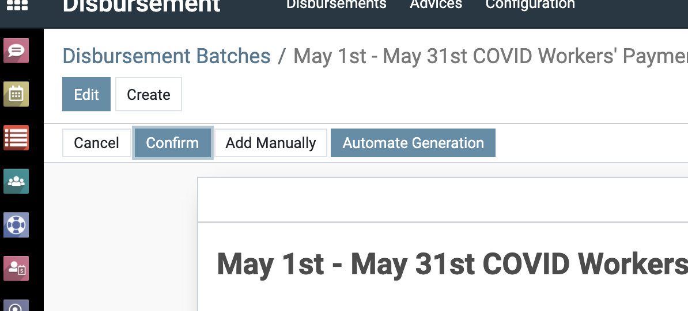{:width="50%"}

On confirmation no further changes can be made to batch without resetting it and is submitted for approval.

#### Approving a Batch

On confirmation, the batch needs to be then approved by a user with the role `Disbursement Fiduciary` after presumed  audit and further validation. The same tools used during the confirmation stage is available to aid this process.

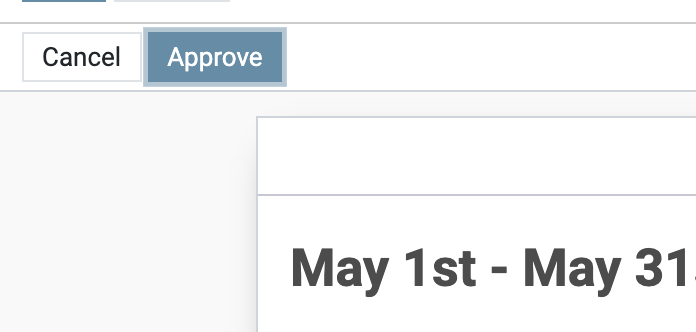{:width="50%"}

### Starting the Disbursement Process

After approval, the disbursement process has to be explicitly triggered by a user with the `Disbursement Manager` role, on clicking the `Start Disbursement` button, payment instructions for the batch are grouped by payment initiator bank with an advice per PI.

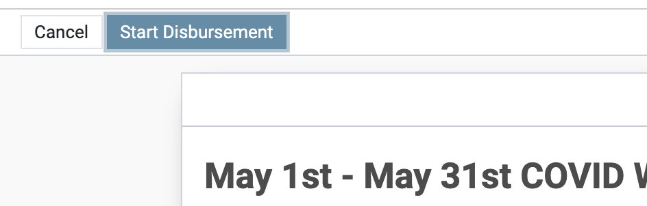{:width="50%"}

Generated advices can be accessed from the batch record.

{:width="50%"}

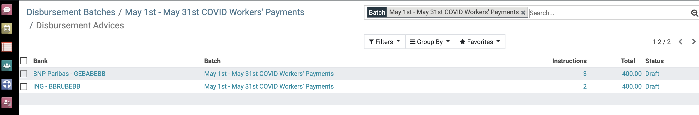{:width="80%"}

The generated batches can then be confirmed and executed. Executing the batch uses the payment initiator associated with that batch to route payment to beneficiary's bank account. Given that we haven't used a payment initiator in this exercise, clicking `Execute` assumes that each bank will serve as its own PI and simply download and save a report that can be sent to that bank manually.

[Lean more about PIs](./advanced/disbursement-configuration.md#Payment-Initiators).

Each advice has to separately **confirmed** and **executed** before the disbursement batch can be closed.

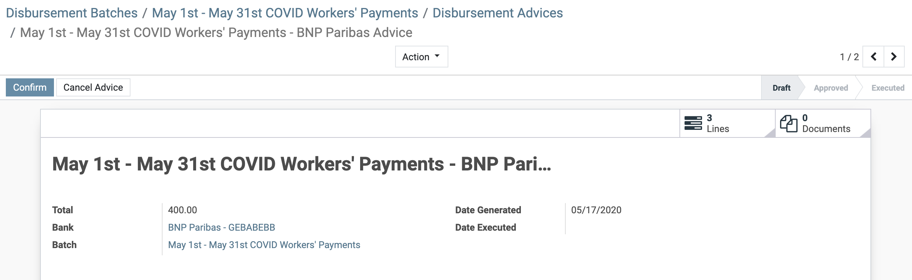{:width="50%"}

{:width="50%"}

## Beneficiary Receipt Notification

@TODO

## Relevant User Roles

@TODO

## Where to go next

- [Learn how to manage your beneficiary registry](./managing-beneficiary.md)
