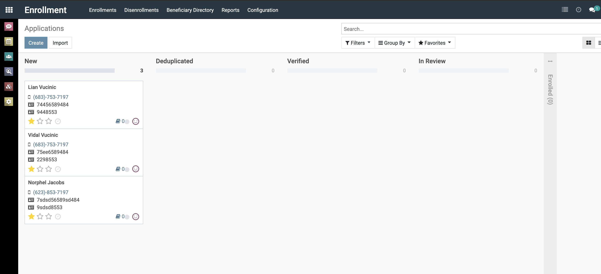
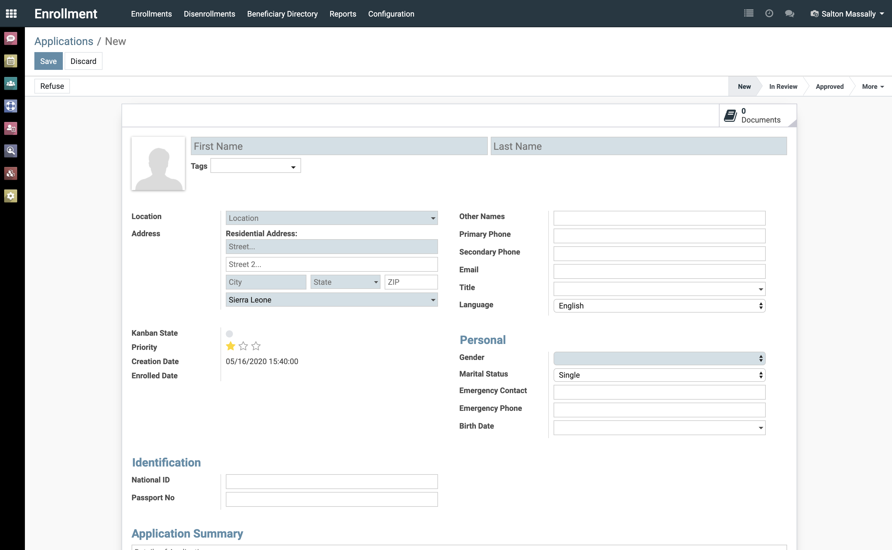
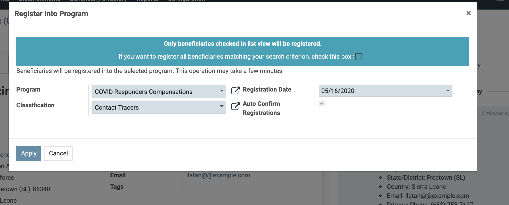
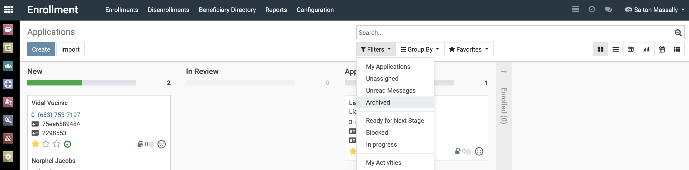
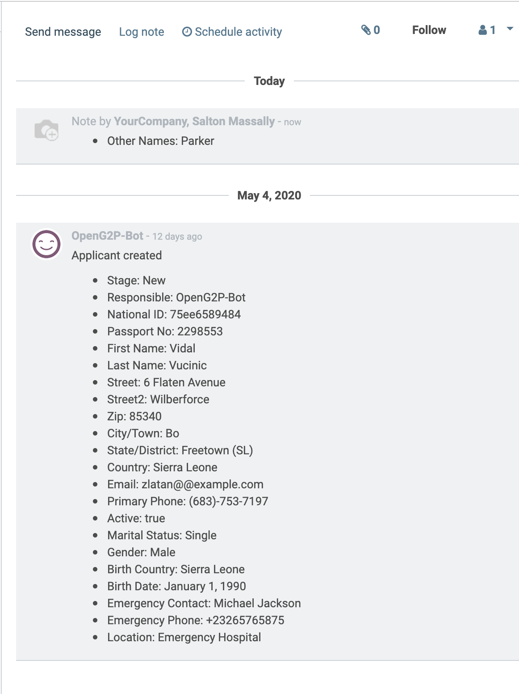
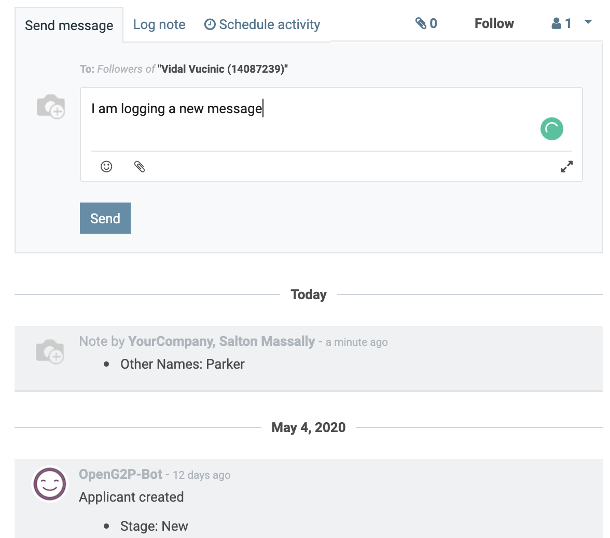
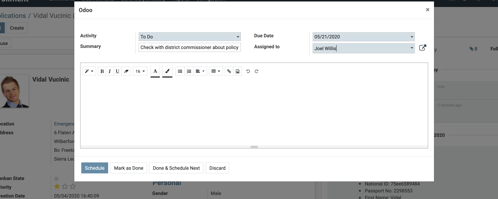
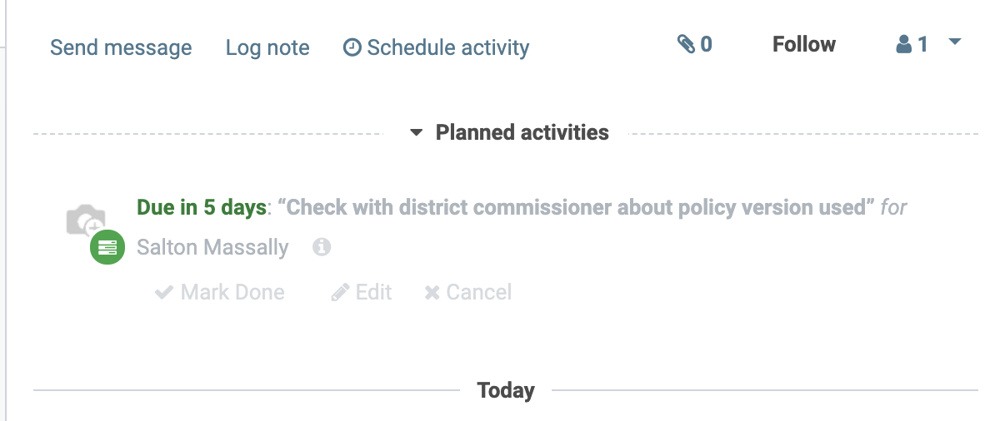

The ERP augments the typical enrollment workflow, shown below, by providing tools that enable process definition, process digitization, and secure and audited process collaboration.

## Registration & Data Collection

The enrollment process typical starts with the collection of registrations for persons wanting to enroll into program. The ERP supports either:

1) Creating registration via the web UI
2) Using an external data collection tool like ODK

### Creating registration via the web UI

Users with the `Enrollment Officer` role ([read about roles here](./usermanagement/auth.md)) can record registrations, via the user interface using the enrollment feature. This can be done either by clicking the `Create` button and filling the form manually for each registration or [`Importing`](advanced/importing-data.md) from an excel or CSV file that may have been exported from a external data collection tool like ODK.

{:width="80%"}

The shaded boxes are required. Supporting documents, e.g. birth or employment certificates, can be attached as part of the registration.

{:width="80%"}

### Using an external data collection tool

Registrations can be created by integrating the ERP with an external data collection tool like [ODK](https://getodk.org/) or Kobo. This enables the collection of data from the field via mobile devices and having that data automatically imported into the ERP's enrollment workflow.

Enrollment via ODK is supported out of the box ([if enabled](../configuration.md#enable-ERP-features)) however other data collection toolkits can be easily integrated; see the [extending section](../extending/benefiary-data-collectors.md).

Further information on collecting beneficiary registrations via ODK can be found [here](./using-odk.md)

## The Enrollment Workflow

Once an registration is created it enters the enrollment workflow. The UI provides an registration tracking system that assists authorized users manage registrations through this flow.

Registrations are by default displayed in columns matching their current state/stage. These columns are aligned with the typical enrollment workflow illustrated earlier, however an ERP administrator can [add, remove, rename states](./advanded/../advanced/advanced-enrollments.md#configuring-application-states)  to reflect their workflow. Registration move along these states as they move through the workflow.

{:width="80%"}

Integration with the [deduplication engine](/deduplicator) and [verification engine](/verificationservice) can aid the "Deduplication" and "Verification" steps.

The deduplication engine, if enabled, will check for potential duplication against enrolled beneficiaries. If found, it blocks progression of that registration along the workflow. In this state, the registration is flagged for investigation and either has to be rejected or that block removed (e.g. if match is a false positive) by a user with the **Enrollment Manager** role.

> Not finding a duplicate is not a certainty that none exist.
>
> Especially if unique IDs are lacking or multiple IDs are supported, the frameworks approach to deduplication is probabilistic and depends on factors like data quality, and matching strategies employed (e.g. biometric provides greater assurances than entity resolution). Inversely, matching a duplicate simply means that there is a high probability that they both refer to the same person (usually > 95% if data quality is ideal) and not that its a certain match. Consequently some human intervention is necessary.
{: .important}

The verification service, if enabled, will use configured [verification sources](../../verificationservice/extending.md#Supporting-Verification-Sources) (e.g. Kiva eKYC, civil registry) to check the identity data provided in the registration for alignment with the ID issuer. If its finds significant misalignment, it  blocks the registration for investigation in a similar fashion as the deduplication check.

Moves between all other states are manual and prerequisites usually will depend on the program's policy, e.g. a compliance officer reviewing employment certificate of the applicant or checking vulnerability before moving to the approved state.

On being approved, a beneficiary record can be created for that registration. This is done by clicking on the `Create Beneficiary` button that will only be visible in the approved state.

{:width="80%"}

If a program to which beneficiary should be registered was not specified as part of the registration, the created beneficiary would have to registered into a program to be part of the disbursement lists for that program. Please note the `enrollment Date` as that affects inclusion in [disbursement lists](program-management.md#What-Determines-Inclusion-in-Disbursement-List)

{:width="80%"}

Congratulations, you have enrolled a beneficiary and registered them into a program. The registration record should then be moved to the `Enrolled` state at which state is archived and can only be accessed by going to the archive.

{:width="80%"}

## Collaboration in Enrollment Process

Beneficiary enrollment can require inputs from multiple geographical dispersed actors. Example, a rural hospital administrator entering an registration for workers at their hospital, that registration then being reviewed by an official in the district office that may have followup questions or require additional supporting documentation, after which final approval being provided by the program manager at the urban Head Quarter. OpenGP helps support decentralization and collaboration in this workflow:

### Role-Based Access

User can be provided with enough access to perform their specific functions within the workflow.

Example: the hospital administrator provided with access to the ERP and boxed to just accessing, creating and managing registrations for that location (his hospital).

@TODO [provide an example of how to create a location user (rights necessary etc)]

### Collaboration Tools

The right hand side (bottom on small screens) of an registration view provides a variety of audit and collaborating tools

See each changes made to the registration, and by whom and when

{:width="50%"}

Log a message that is sent to all users subscribed to that registration (location manager, user who created registration, and each user involved thus far in the flow). Or log a note that is simply recorded as part of that thread.

{:width="50%"}

Schedule an activity and assign to yourself or someone else. Example "Check new policy version to make sure under 18s qualify for program"

{:width="50%"}

{:width="50%"}

### Automating Beneficiary Messaging

Registration stages can be configured with email and SMS templates that sends email and SMS messages respectively to the applicant upon registration reaching that stage; see [Configuring Registration States](./advanced/advanced-enrollments.md#configuring-application-states). [Automating Communication with Applicants](advanced/advanced-enrollments.md#Automating-Communication-with-Applicants) provides further instructions on this.

## Relevant User Roles

@TODO [each role and what they can do in the flow]

## A Recap of the Enrollment Process

1. Enrollment start with registrations being recorded
2. Registrations move through series of states until approved or rejected
3. On approval a beneficiary record is created for the registration
4. Then that beneficiary registered into a program

## Where to go next

- [Learn how to process disbursements](./disbursing.md)
