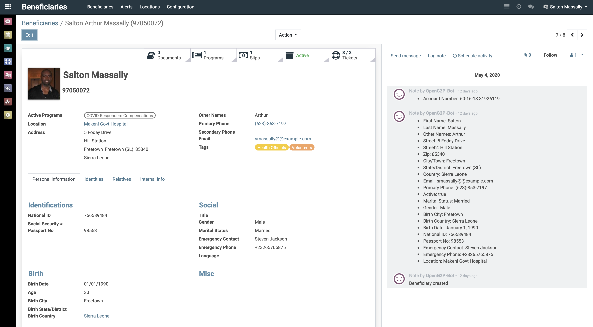
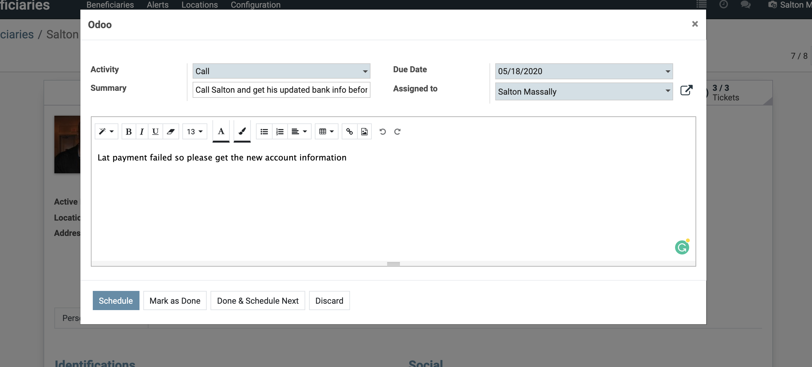
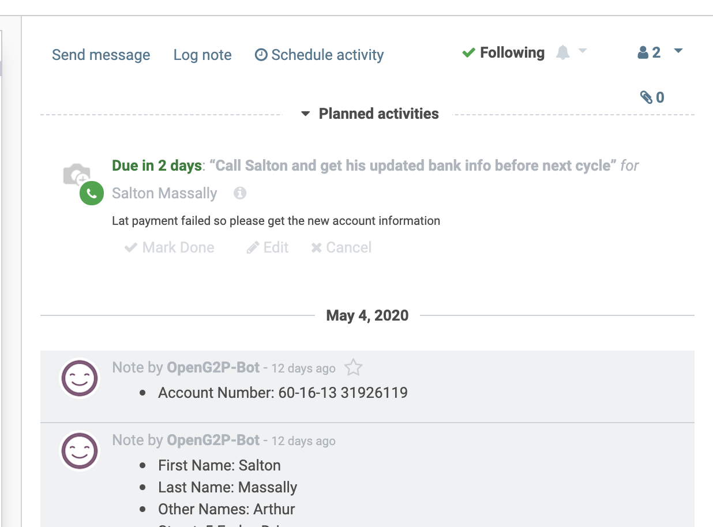
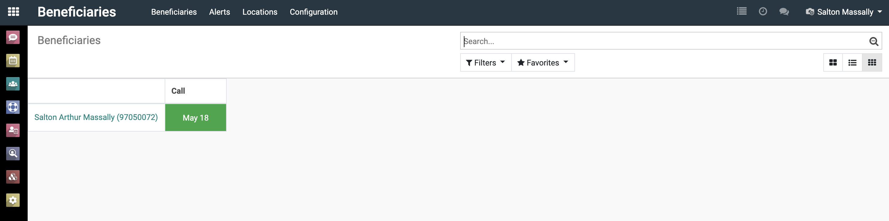
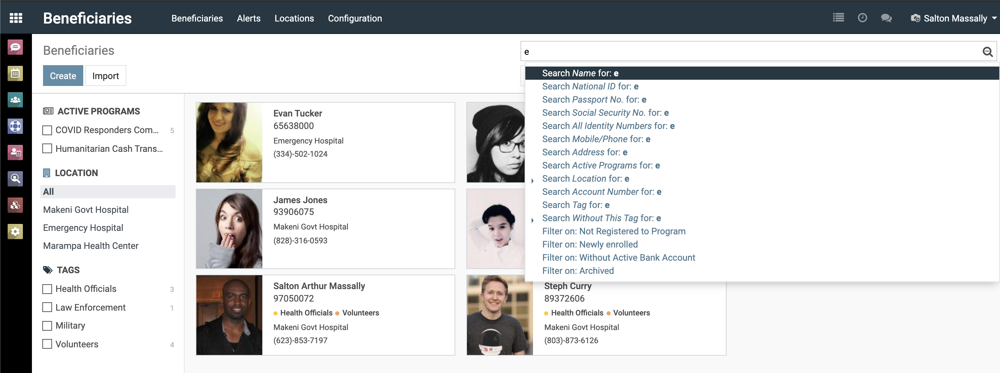
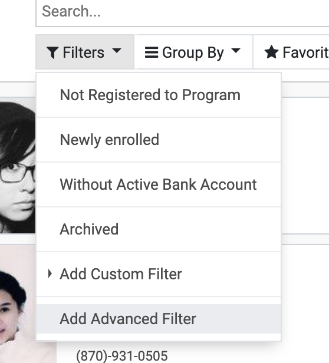
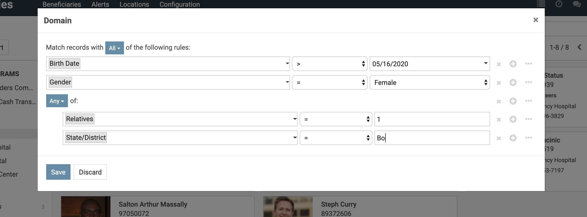
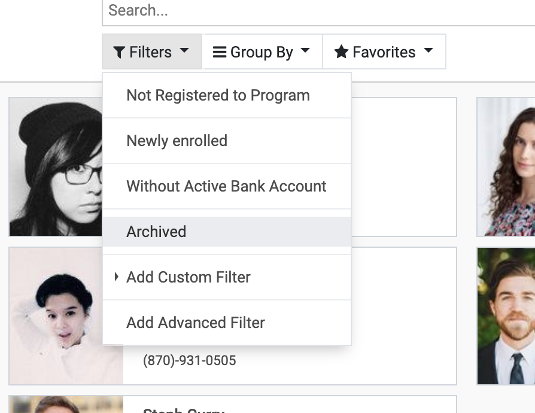

The beneficiary registry provides a coherent 360-degree view of beneficiaries across your programs. It enables you to search for, create dynamic reports, and see all records relating to a beneficiaries.

## 360-degree View of Beneficiaries

{:width="80%"}

Viewing a beneficiary's record provides a 360-degree view of that beneficiary. Not can you immediately access the beneficiary's details but also associated records and documents like:

- program enrollment history
- history of disbursement slips
- complaints history
- attached documents
- perform various actions

Additionally on the right hand side of the beneficiary detail (bottom on smaller screens), you can access:

- audit trail of all changes made to a beneficiary's record, see what changed, who changed and when
- send messages and log notes pertaining to the beneficiary
- schedule action and activities pertaining to the beneficiary and assigned responsibility. E.g. "Call Salton and get his updated bank info before next cycle" and assign to the administrator at Salton's location.

{:width="50%"}

{:width="50%"}

The list of unresolved activities can be viewed by going to the [activity view](advanced/understanding-the-ui.md) which tracks and shows pending activities.

{:width="50%"}

## Updating Beneficiaries Data

Beneficiary's data can be updated by users with the `Analyst` role. All changes are recorded to the audit log and timestamped

## Tagging Beneficiaries

@TODO

## Searching and Filtering Beneficiaries

The ERP Provides tools to aid discovery, filtering, and reporting on beneficiaries. Default commonly used filters are provide on the right of the beneficiary registry view. With these users can filter by active programs, locations, and tags. However the search box also provides a variety of options as shown in the image below. By default clicking enter searches on the beneficiary's name and internal ID. However typing your search text in the search box and clicking on any of the other options runs that search against the field text displayed for those options. Search text does not need to be specified for the `Filter On` fields.

{:width="50%"}

If the predefined search and filter criteria does not meet you need or you want to run advanced filters that chains a combination of fields, e.g. filter by female beneficiaries, younger than 21, with 5 dependents or with living in the Bo district, you can use the `Add Advanced Filter` option that provides a popup via which you can chain complex filter conditions using **AND** and **OR** operators.

{:width="30%"}

{:width="80%"}

These can be used to create complex reports or perform targeted mass actions. Example enroll those fitting the above criteria into an additional social protection program. See the [advanced guide](advanced/understanding-the-ui.md) for more information about performing complex filtering operation, and creating custom reports from these.

## Exporting Beneficiary Data

Beneficiary data can be exported by users in the `Manager` role to CSV or excel. This allows import into other tools, e.d a BI tools.

@TODO[show how]

## Archiving Beneficiaries

This process is very similar to the deregister beneficiary from program workflow, so please [refer to that](./program-management.md#Removing-Beneficiaries-from-Program). The only difference is that in the popup form, for the field `Type` the option "End of Programs and Archive" should be selected. This ends all active program enrollment that beneficiary belongs to and archives that beneficiary's record.

## Viewing Archived Beneficiaries

Archived beneficiaries can be viewed by filtering by `Archived`

{:width="50%"}

Beneficiaries can be reactivated by a user with `Manager` role.

@TODO[show how]

You will need to re-register that reactivated beneficiary to a program.

## Beneficiary Data Alerts

@TODO

## Where to go next

- [Handling beneficiary complaints](./redressal.md)
