## **Task**

### Tasks
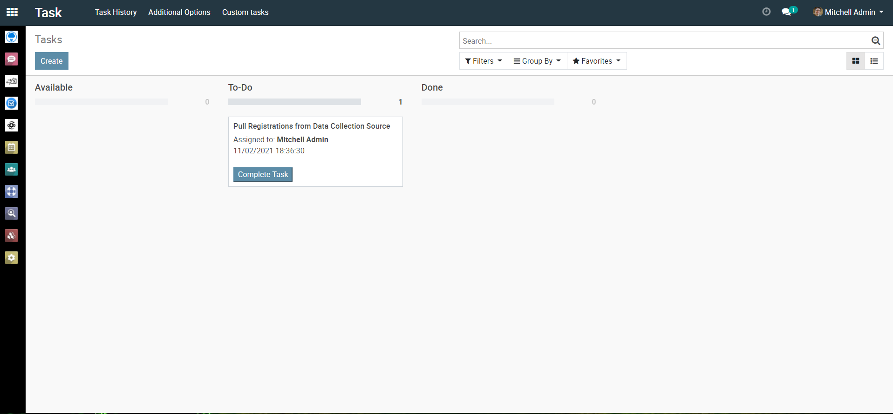
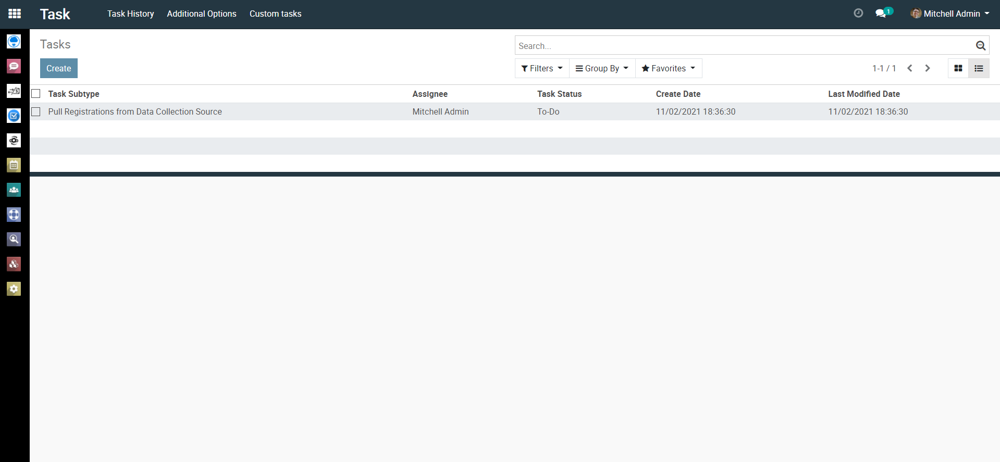

### Task History
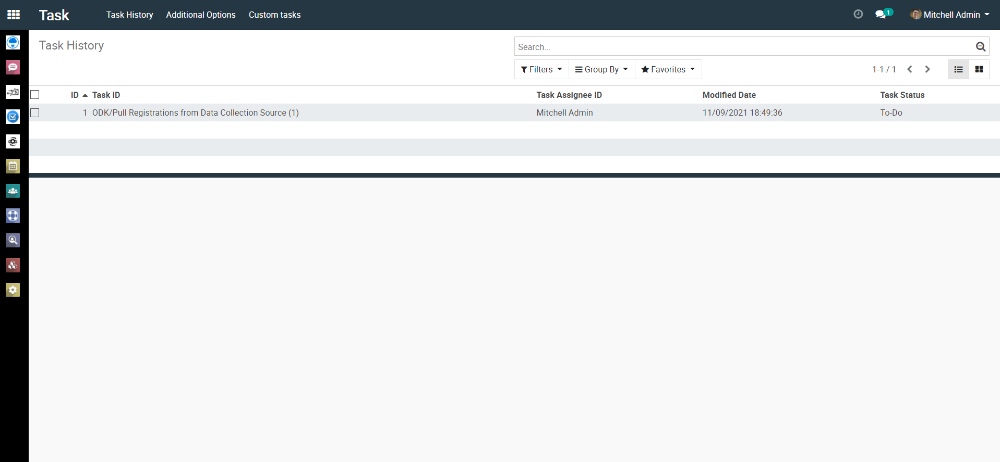

### Task Type
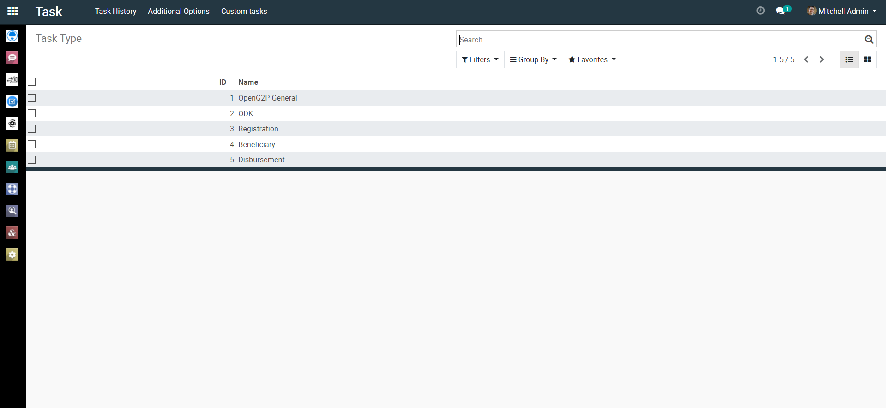

### Task Role
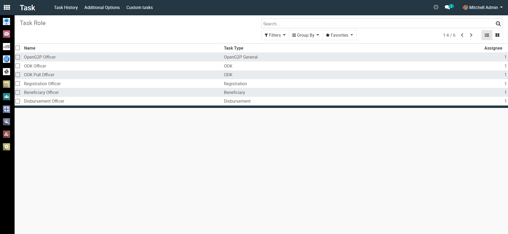

### Task Subtype
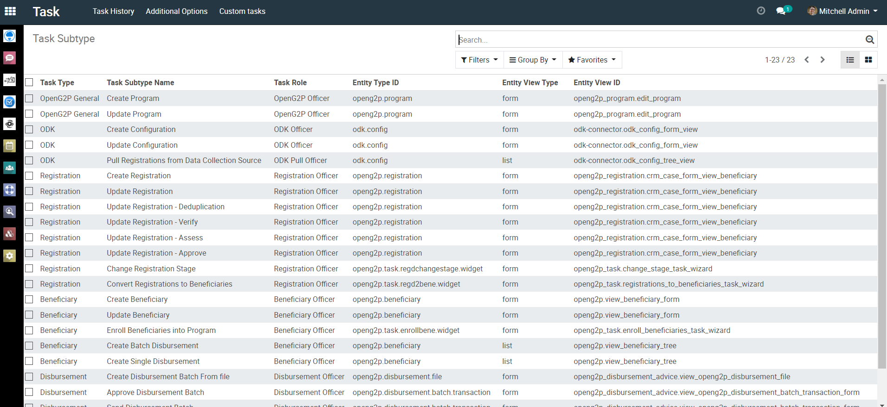

## Custom Tasks

### Change stage of Registrations
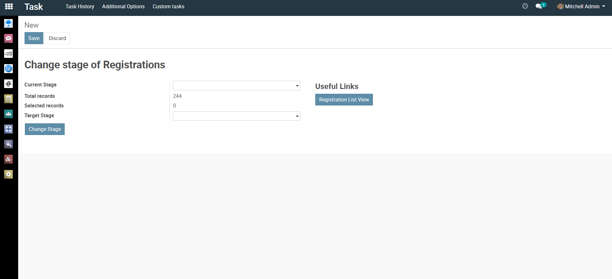

### Convert Registrations to Beneficiaries
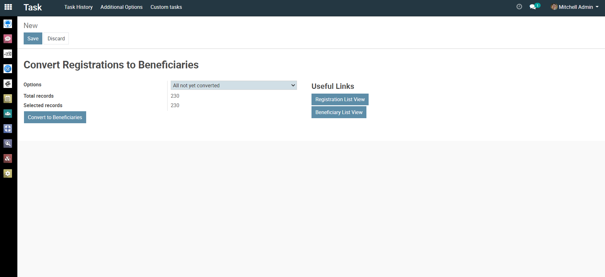

### Enroll Beneficiaries Into Programs
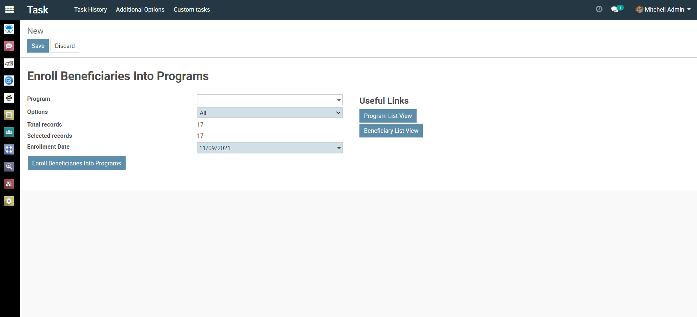

## Process
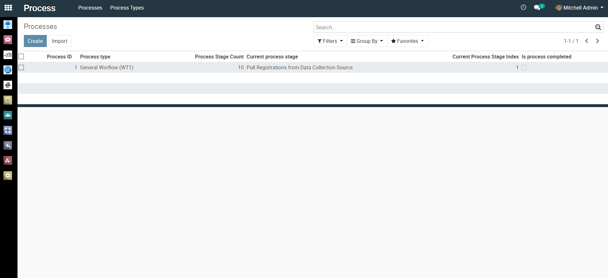
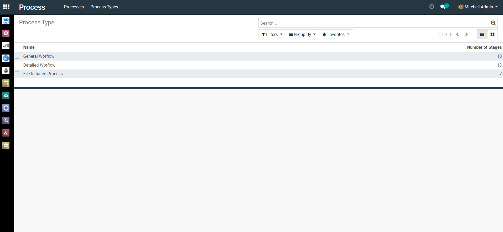
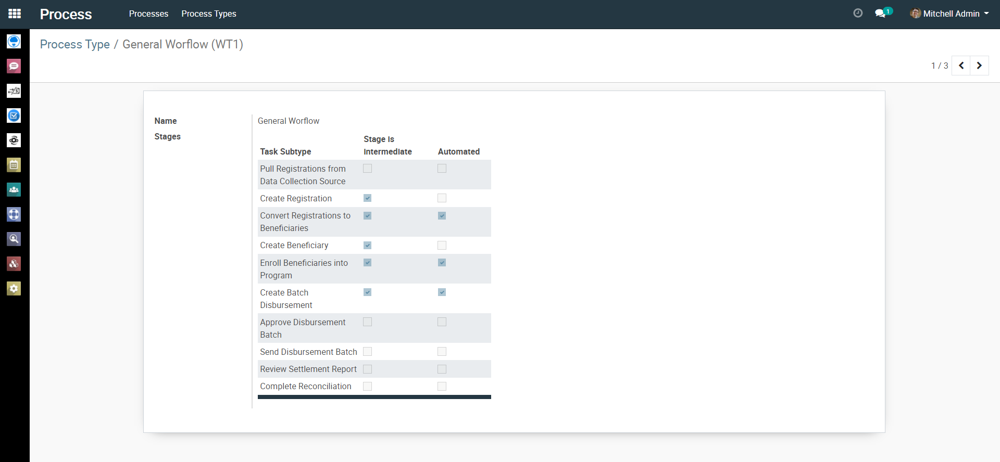

